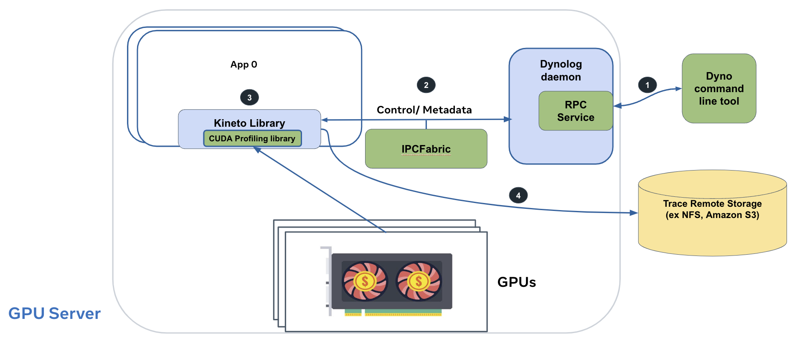

# On-demand Profiling For Pytorch application

## Introduction
Debugging performance on distributed AI applications can be challenging. Currently, developers can examine their PyTorch training applications programmatically using the [PyTorch Profiler API](https://pytorch.org/docs/stable/profiler.html).
However, the user needs to edit their python code to get this data, and likely relaunch their jobs.


Dynolog enables profiling distributed AI applications on-demand i.e without any code changes. Essentially, dynolog provides a service that enables users to request a PyTorch profile.
On receiving a profiling request dynolog uses inter-process communication to configure the PyTorch profiler within the application. This is illustrated in the following diagram.


The following instructions walk through:
1. How to setup PyTorch to enable on-demand profiling.
2. Configure the pytorch application environment.
3. Use dynolog along with a job scheduler like slurm.
4. Profile a distributed training job - full example.

## PyTorch Setup
> Note that these instructions will likely change. We need recent commits in PyTorch to enable this feature. As a new PyTorch release takes place users will not need to build PyTorch from source.

Currently, we need to build PyTorch from source to obtain the latest changes that make it compatible with dynolog.
Please follow the instructions in [PyTorch README](https://github.com/pytorch/pytorch/blob/master/README.md) on obtaining the setup. Ensure that your checkout has the [PR#88020](https://github.com/pytorch/pytorch/pull/88020/) (use `git log` to check).

Before building, also pull in latest changes from Kineto dependency using:
```bash
  cd third_party/kineto/libkineto
  git checkout main
  cd -
```
The minimum version needed is one containing [PR#653](https://github.com/pytorch/kineto/pull/653/), commit a36e47e6d080abd62ca26dd2a007c8f4cd0bd600

Lastly, disable the `USE_LITE_INTERPRETER_PROFILER` setting. One way to do this is change the option in `pytorch/CMakeLists.txt`.
```
if(USE_LITE_INTERPRETER_PROFILER)
- string(APPEND CMAKE_CXX_FLAGS " -DEDGE_PROFILER_USE_KINETO")
+ # string(APPEND CMAKE_CXX_FLAGS " -DEDGE_PROFILER_USE_KINETO")
endif()
```
You are all set to build and install PyTorch.
```bash
python setup.py install
```

## On-demand tracing locally

### Spin up dynolog
On a local machine you can run dynolog and use the command line tool to trace your application.
To run dynolog execute the following in a new terminal window or [use a package manager](../scripts/README.md).
```bash
./build/dynolog/src/dynolog --enable_ipc_monitor
```

### Running the pytorch program
For pytorch we need to setup the following environemnt first
```bash
echo "ENABLE_IPC_FABRIC=YES" > ~/libkineto.conf
export KINETO_CONFIG=~/libkineto.conf
export KINETO_USE_DAEMON=1
```

Now you can run the pytorch program. We included a simple example pytorch script for you to test out this flow.
```bash
python3 scripts/pytorch/linear_model_example.py
```
Alternatively, you can set the environment variables on the command line.
```bash
KINETO_CONFIG=~/libkineto.conf KINETO_USE_DAEMON=1 python3 scripts/pytorch/linear_model_example.py
```

In the output of the script you should see a message as follows.
```
INFO:2022-10-22 00:59:13 151209:151209 init.cpp:98] Registering daemon config loader
```

### Triggering an on-demand trace
You can now trigger trace using the dyno command line tool. Dynolog will try to find a pytorch process runing on the machine. It can also filter processes by pid or job id. On a succeessful match the command line tool will print the path where the trace file will be written to:
```bash
$> ./build/release/dyno gputrace --log-file /tmp/libkineto_trace.json

Matched 1 processes
Trace output files will be written to:
    /tmp/libkineto_trace_151419.json

```

### Triggering traces on a remote node
To trigger trace on a remote node you can use the `--host-name` flag.
```bash
dyno --host-name a100-st-p4d24xlarge-42 gputrace --log-file /path/to/log/file/libkineto_trace.json
```

It is likely that a single node can run multiple jobs. Pytorch/Kineto can recognize job IDs
of processes run under the SLURM job scheduler. You can pass a job id to filter requests as follows.
```bash
dyno --host-name a100-st-p4d24xlarge-42 gputrace --job-id 4242 --log-file /path/to/log/file/libkineto_trace.json
```

## Tracing a distributed application
Lastly, this section talks about how to profile a full scale traing jobs containing multiple nodes.
We provide an example with SLURM, a job scheduler commonly used in HPC environments.

### Launching job with dynolog
In case dynolog is not deployed on your cloud/cluster you can launch the dynolog binary
with your job. The script `run_with_dyno_wrapper.sh` can be used for this purpose.

This script will spin up a dynolog process first and then run your job's command. It will also
setup the required environment variables. An example is shown below:
```bash
srun ./scripts/slurm/run_with_dyno_wrapper.sh <desired launch cmd>
# example
srun ./scripts/slurm/run_with_dyno_wrapper.sh python3 ./scripts/pytorch/linear_model_example.p

```

### Profiling a distributed job (unitrace.py)
After the job attaches to dynolog, we can use a utility script `unitrace.py` to profile the entire job.
`unitrace.py` requires the **job id** and it allows users to:
1. Lookup the nodes running the job.
2. Send dyno gputrace requests to all nodes as required.

> Currently, this script only works with SLURM job scheduler. Further, job ids with an underscore or `_` in the name are not supported. This can be easily extended to more schedulers.

The usage of the `unitrace.py` script is pretty straight forward.
```
Usage: ./scripts/pytorch/unitrace.py [slurm_job_id] [output_dir]
```
- where output_dir will be the top level directory for saving traces. `unitrace.py` will save a new trace file for each job using the naming convention `libkineto_trace_<slurm_job_id>_<pid_of_process>.json`

For example, the following command traces the job 65788044
```bash
./scripts/pytorch/unitrace.py 65788044 /tmp/trace_65788044/
```

This produces output such as:
```
Found hosts string = learnfair[1773,1775-1776,1798,1800,1809,1811-1812]
Hosts = ['learnfair1773', 'learnfair1775', 'learnfair1776', 'learnfair1798', 'learnfair1800', 'learnfair1809', 'learnfair1811', 'learnfair1812']
Running cmd: ./build/release/dyno --hostname learnfair1773 gputrace --job-id 65788044 --log-file /tmp/trace_65788044/libkineto_trace_learnfair1773.json
...
```

## Questions?

For support on this feature please raise a github issue or contact us via email mentioned in the [README](../README.md) page.
